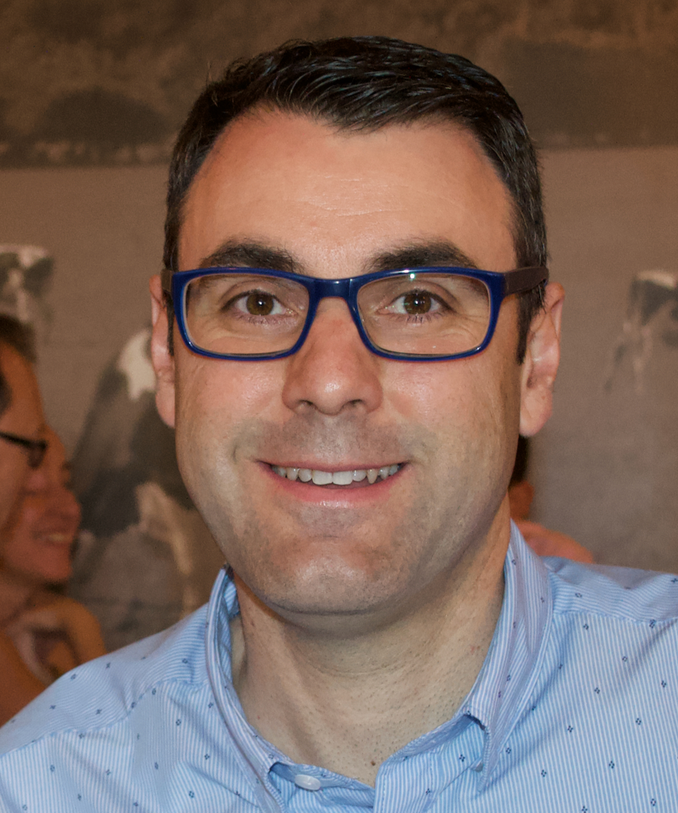

```{r setup, include=FALSE}
knitr::opts_chunk$set(echo = FALSE)

# Learn more about creating websites with Distill at:
# https://rstudio.github.io/distill/website.html

# Learn more about publishing to GitHub Pages at:
# https://rstudio.github.io/distill/publish_website.html#github-pages

```

<center>

{ width=20%}


</center>


- I was born in Dénia (Spain) in 1972 and graduated in Statistics (2000). I got my PhD in Statistics in 2009. The thesis title was "Geostastistical models for bioclimatic indices" and my advisors were Javier Morales(Miguel Hernandez University) and Antonio López-Quílez (Valencia University).

- I have been teaching and doing research at Miguel Hernández University since 2003. I became Associate Professor of Statistics and Operations Research in 2018.

- You will be able to find here "all" about my skills and my academia carrier. You can also see my recent publications, or links to the typical academic information pages like ORCID, Scholar, etc.

<center>

*I like to enjoy riding my bike (with my "grupetta") whenever I can, whether in the mountains or on the road... whatever it is, but always to the rhythm of  Motorhead-style R'n'R.*

**Enjoy it!**.

<p>
</center>