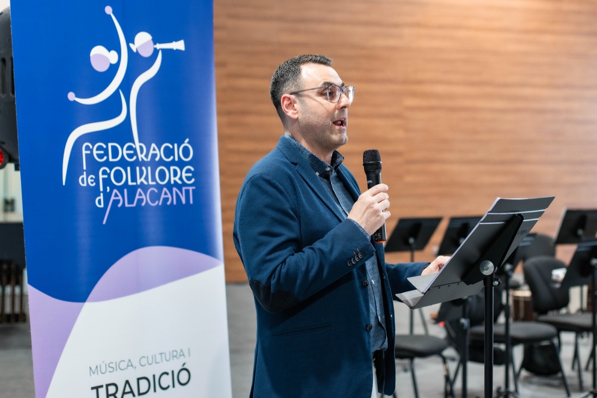
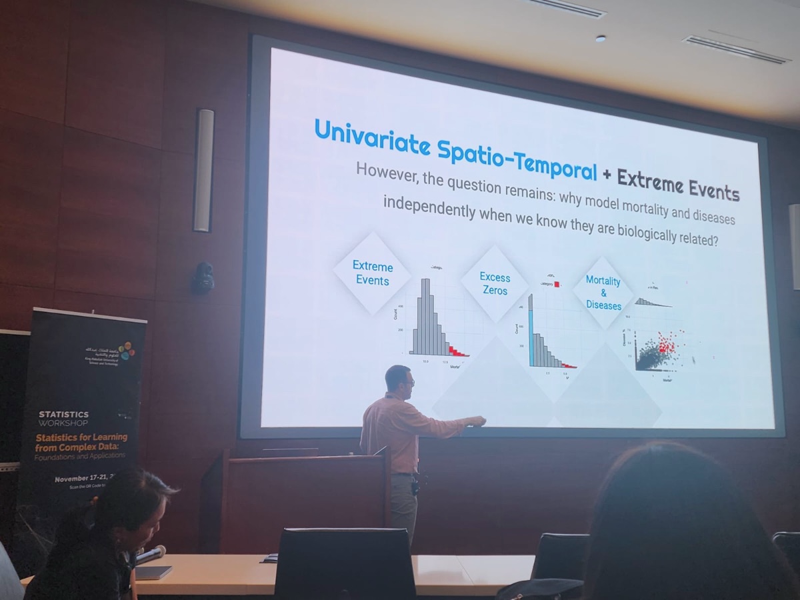
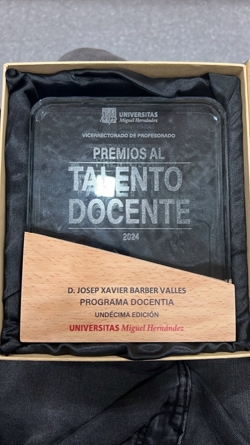
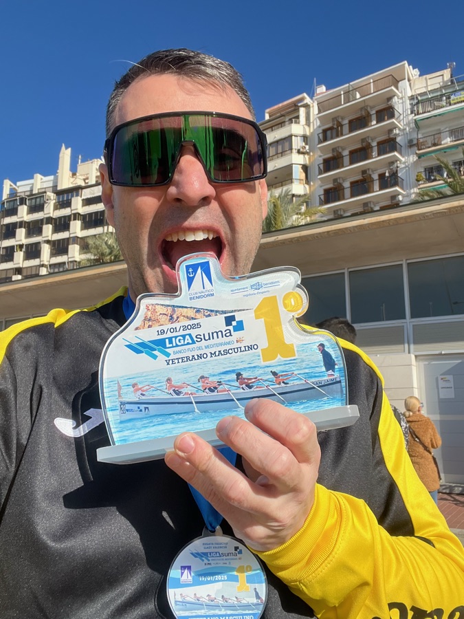

<section class="hero" aria-labelledby="intro-title">

Research · Knowledge transfer · i-MInD

<h1 id="intro-title">Xavier BarberData. Intelligence. Better decisions.</h1>

Artificial Intelligence &amp; statistical science, from research to real-world applications.

Full Professor of Statistics and Operations Research Universidad Miguel Hernández de Elche

<a class="button primary" href="xbarber.html">Research &amp; transfer ↗</a><a class="button" href="https://portalinvestigacion.umh.es/investigadores/2181582/detalle">Academia · UMH ↗</a>

<a class="orcid" href="https://orcid.org/0000-0003-3079-5855">iD ORCID 0000-0003-3079-5855 ↗</a>

<figure class="portrait-frame"><figcaption>STATISTICS × ARTIFICIAL INTELLIGENCE<strong>Connecting methods with meaningful impact.</strong></figcaption></figure>
</section>

<strong>i-MInD</strong>Instituto en Matemáticas, Inteligencia Artificial y Ciencia de Datos

I research statistical and Artificial Intelligence methods and transfer them into practical applications. My work combines Bayesian modelling, spatial and spatio-temporal statistics, and machine learning to quantify uncertainty and support decision making.

I collaborate with researchers, companies and public institutions in health, ecology, environmental science and economics. With Juan Aparicio and colleagues, I develop methods and software for efficiency and productivity analysis.

<a href="cva.html#artificial-intelligence">Artificial Intelligence papers</a><a href="cva.html#spatial-statistics">Spatial statistics</a><a href="cva.html#efficiency-productivity">Efficiency &amp; productivity</a>

## Artificial Intelligence in research and knowledge transfer

My research includes machine learning for species distribution and clinical prediction, Bayesian networks, and learning methods for production frontiers. My knowledge-transfer activity includes applied statistical and AI consulting, open-source software, and training in generative AI for public administrations.

[Explore research and knowledge transfer](xbarber.html) · [Read my CV and selected publications](cva.html)

## Selected research highlights

- **Spatial modelling:** [disease modelling under spatial misalignment](https://doi.org/10.4081/gh.2016.415) and [multivariate bioclimatic models](https://doi.org/10.1007/s13253-018-00345-z).
- **Efficiency and productivity:** [production functions based on regression splines](https://doi.org/10.1016/j.ejor.2023.06.035) and the [`eat` R package](https://doi.org/10.32614/RJ-2022-054), with Juan Aparicio and colleagues.
- **Interdisciplinary impact:** [BIMCV COVID-19+](https://arxiv.org/abs/2006.01174), a preprint describing an imaging dataset, and the [large-scale population survey of the COVID-19 pandemic in Spain](https://doi.org/10.2196/21319).

<section class="photo-story" aria-labelledby="photo-story-title">

A closer look

<h2 id="photo-story-title">Research, teaching &amp; life beyond.</h2>

<figure class="photo-wide"><figcaption>Research<strong>Sharing spatial statistics.</strong></figcaption></figure>
<figure><figcaption>Teaching<strong>UMH · Talento Docente 2024</strong></figcaption></figure>
<figure><figcaption>Beyond research<strong>Teamwork, on the water.</strong></figcaption></figure>

</section>

## Beyond research

I am from Dénia, Spain. I graduated in Statistics in 2000 and completed my PhD in 2009, supervised by Javier Morales and Antonio López-Quílez. Outside work, I enjoy rowing, cycling with my grupetta, and the music of Motörhead.

Academia
<h2>My academic work, in full.</h2>
Explore my institutional profile, research activity and publications at Universidad Miguel Hernández.

<a class="button primary" href="https://portalinvestigacion.umh.es/investigadores/2181582/detalle">Official UMH profile ↗</a>

